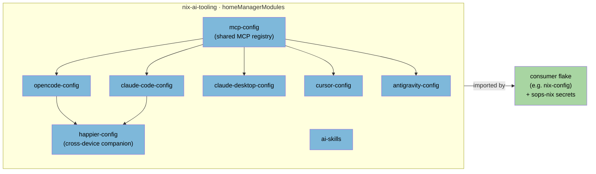

# nix-ai-tooling

Reusable [home-manager](https://github.com/nix-community/home-manager) modules
for configuring AI coding agents declaratively. Extracted from a personal
NixOS config so the pieces can be shared across machines and users.

All secrets are referenced as `{env:VAR}` placeholders or via env-var-name
options — the modules never embed credentials. The consumer is responsible for
populating those environment variables (e.g. from sops-nix, `/run/secrets`, or
a shell profile).



## Modules

| Module | Option namespace | What it does |
| --- | --- | --- |
| `mcp-config` | `programs.mcp-config.*` / `programs.mcp.servers.*` | Shared registry of MCP servers (mcp-nixos, telegram, jobspy, github, playwright, thunderbird) consumed by the other agent modules. |
| `opencode-config` | `programs.opencode-config.*` | Generates `opencode.json`, provider configs (OpenCode Go/Zen, Groq, custom), MCP wiring, named profiles with per-profile wrapper scripts, secret loading, and an `oc` billing-context dispatcher. |
| `claude-code-config` | `programs.claude-code-config.*` | Generates Claude Code config (commands, settings). |
| `cursor-config` | `programs.cursor-config.*` | Generates Cursor editor AI config. |
| `antigravity-config` | `programs.antigravity-config.*` | Generates Antigravity config. |
| `ai-skills` | `programs.ai-skills.*` | Cross-agent skills: deploys a shared skill set into each agent's skills directory (incl. per-opencode-profile fan-out). |
| `happier-config` | `programs.happier-config.*` | Happier cross-device companion: installs CLI, configures daemon for remote session control, integrates with Claude Code/OpenCode/Jcode providers. |

## Usage

```nix
{
  inputs.nix-ai-tooling.url = "github:DiegoBarrosA/nix-ai-tooling";
  # ... your other inputs (nixpkgs, home-manager) ...

  outputs = { self, nixpkgs, home-manager, nix-ai-tooling, ... }: {
    homeConfigurations."me" = home-manager.lib.homeManagerConfiguration {
      pkgs = import nixpkgs { system = "x86_64-linux"; };
      modules = [
        # Bring in every AI-tooling module at once:
        nix-ai-tooling.homeManagerModules.default

        {
          programs.mcp-config.enable = true;
          programs.mcp-config.mcpNixos.enable = true;

          programs.opencode-config = {
            enable = true;
            opencodeGo.enable = true;
            secretEnv.OPENCODE_API_KEY = "/run/secrets/opencode-api-key";
          };

          # Enable Happier for cross-device AI tool access
          programs.happier-config = {
            enable = true;
            daemon.enable = true;
            providers = {
              claude.enable = true;
              opencode.enable = true;
            };
            secretEnv.GITHUB_TOKEN = "/run/secrets/github-token";
          };
        }
      ];
    };
  };
}
```

Import individual modules instead of `default` if you only want a subset, e.g.
`nix-ai-tooling.homeManagerModules.opencode-config`.

### opencode-config: profiles and the `oc` dispatcher

`programs.opencode-config.profiles.<name>` defines named profiles, each with its
own config dir and wrapper script (`opencode-<name>` by default, overridable via
`scriptName`). Nothing customer-specific is baked in: define whatever providers,
models, and MCP allowlists a profile needs at the call site.

The `oc` billing-context dispatcher (`programs.opencode-config.dispatcher`)
selects a profile wrapper based on `OPENCODE_BILLING_CONTEXT`. It has no contexts
by default — add your own:

```nix
programs.opencode-config.dispatcher.contexts = {
  personal = { scriptName = "ocp"; apiKeyEnvVar = "OPENCODE_API_KEY"; };
  groq = { scriptName = "ocg"; apiKeyEnvVar = "GROQ_API_KEY"; };
};
```
